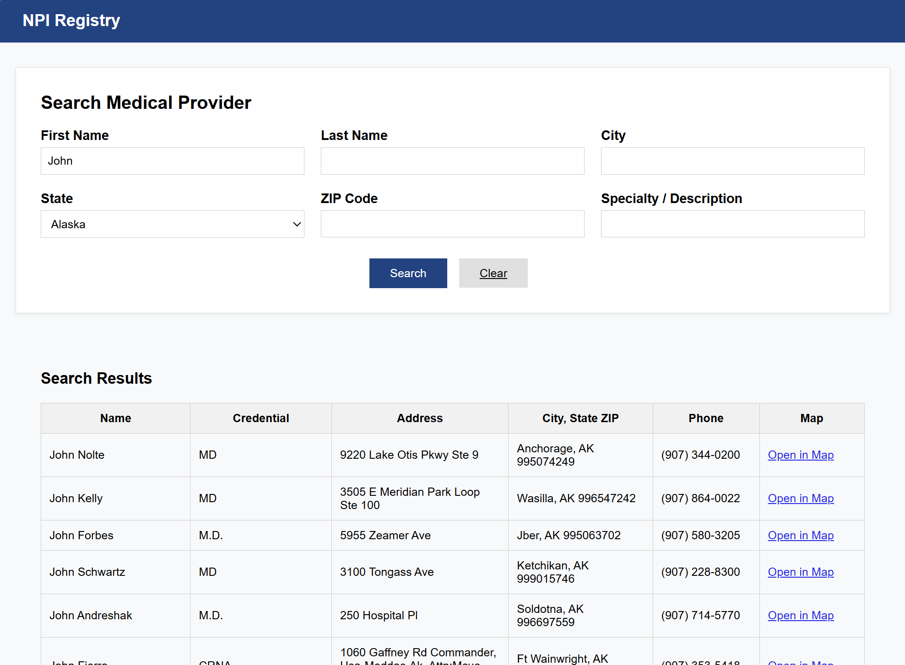

# Provider Lookup – Django & PostgreSQL

This project is a Django-based search tool for querying U.S. healthcare providers by name, city, state, ZIP code, or specialty.  
It uses a PostgreSQL database populated with over 6 million provider records from CSV files.  
The application supports **bulk loading** for large datasets and a clean, user-friendly search interface.

---
## UI Preview

_Search results for Joohn in Alaska_
## Features

- **Bulk loading** of providers, taxonomies, and provider–taxonomy links for fast imports
- Search by:
  - First name
  - Last name
  - City
  - State (dropdown)
  - ZIP code
  - Specialty / Description
- Search results table with:
  - Clickable Google Maps link
  - Credential display
  - Formatted phone numbers
  - Improved column widths for readability

---

## How It Works

### Main Script: `load_data.py`

- Loads:
  - **Providers** from `providers.csv`
  - **Taxonomies** from `taxonomy.csv`
  - **Provider–taxonomy links** from `provider_taxonomies.csv`
- Uses `bulk_create()` with batching for performance
- Prints progress percentage while loading

---

### Search View: `views.py`

- Defines `US_STATE_CHOICES` for the dropdown
- Filters results based on user inputs
- Passes query results to `search.html` template

---

### Template: `search.html`

- Responsive form layout for entering search criteria
- Results displayed in a table:
  - Name, credential, address, city/state/ZIP, phone, and map link
- Uses a custom template tag to format phone numbers

---

## Files

`load_data.py` – Bulk CSV loader for all data  
`views.py` – Search logic and state dropdown setup  
`search.html` – Search form + results table  
`templatetags/formatting.py` – Custom phone number formatting  
`models.py` – Provider, Taxonomy, and ProviderTaxonomy models

---

## Requirements

- Python 3.12+
- Django
- PostgreSQL

Install with:

```bash
pip install django psycopg2
